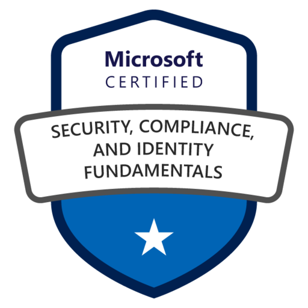

<h1>Hi, I'm Alfonso! 
        Cybersecurity Professional</h1>

<h2>👨‍💻 My Projects:</h2>

- <b>IAM Project: From On-Premises to Modern Hybrid Identity with SSO</b>
  - [On-Prem to Hybrid Identity with SSO](https://github.com/alfonsonyc2005/IAM_Lab)

- <b>Azure / Cloud Cybersecurity Project</b>
  - [Creating a Live SOC / Honeynet in Azure](https://github.com/alfonsonyc2005/Azure-SOC/blob/main/README.md)

- <b>Active Directory Home Lab using PowerShell</b>
  - [Active Directory Home Lab](https://github.com/alfonsonyc2005/Active_DirectoryLab/blob/main/README.md)
  

<h2>📄Certifications</h2>

- [CISSP - Certified Information Security Professional](https://raw.githubusercontent.com/alfonsonyc2005/alfonsonyc2005/main/CISSP.png)
- [Microsoft Certified: Azure Fundamentals (AZ-900)](https://raw.githubusercontent.com/alfonsonyc2005/alfonsonyc2005/main/microsoft.png)
- [Microsoft Certified: Security, Compliance, and Identity Fundamentals (SC-900)](https://raw.githubusercontent.com/alfonsonyc2005/alfonsonyc2005/main/MSsecurity.png)
- [GRC Mastery](https://raw.githubusercontent.com/alfonsonyc2005/alfonsonyc2005/main/grcmastery.png)
 

<h2> 🤳 Connect with me:</h2>

[][linkedin]

[linkedin]: https://www.linkedin.com/in/alfonso-padilla-tech9

