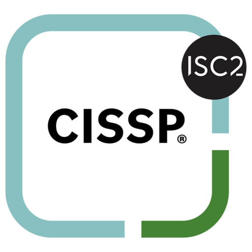

<h1>Hi, I'm Alfonso Padilla</h1>
<h3>Senior SOC Analyst | IAM & Cloud Security | Microsoft Security Stack</h3>

I’m a cybersecurity professional with a strong foundation in security operations, threat detection, and incident response across hybrid enterprise environments. My experience spans endpoint, identity, and cloud security, with hands-on work using Microsoft Defender, Sentinel, and Entra ID to investigate threats and strengthen organizational defenses.

I’m currently focused on expanding into Identity & Access Management and Cloud Security Engineering, with particular interest in Zero Trust architecture, identity governance, and cloud-native detection engineering. My projects demonstrate practical experience designing hybrid identity environments, building Azure-based SOC capabilities, and automating identity operations using PowerShell.

<h2>👨‍💻 Featured Projects</h2>

<b>Hybrid Identity & IAM</b>  
Design and implementation of a hybrid Active Directory and Microsoft Entra ID environment with federated SSO and MFA enforcement.  
🔗 <a href="https://github.com/alfonsonyc2005/IAM_Lab">On-Prem to Hybrid Identity with SSO</a>

  

<b>Azure SOC & Detection Engineering</b>  
Deployed a live cloud honeynet to analyze real-world attack telemetry using Microsoft Sentinel and Log Analytics, then measured the impact of security hardening.  
🔗 <a href="https://github.com/alfonsonyc2005/Azure-SOC">Azure SOC / Honeynet</a>

  

<b>Active Directory & Automation</b>  
Built an on-prem Active Directory lab and automated bulk user provisioning (~1,000 users) using PowerShell to demonstrate identity lifecycle management.  
🔗 <a href="https://github.com/alfonsonyc2005/Active_DirectoryLab">Active Directory Home Lab</a>

---

<h2>📄 Certifications</h2>

---

<h2>🤝 Connect</h2>

